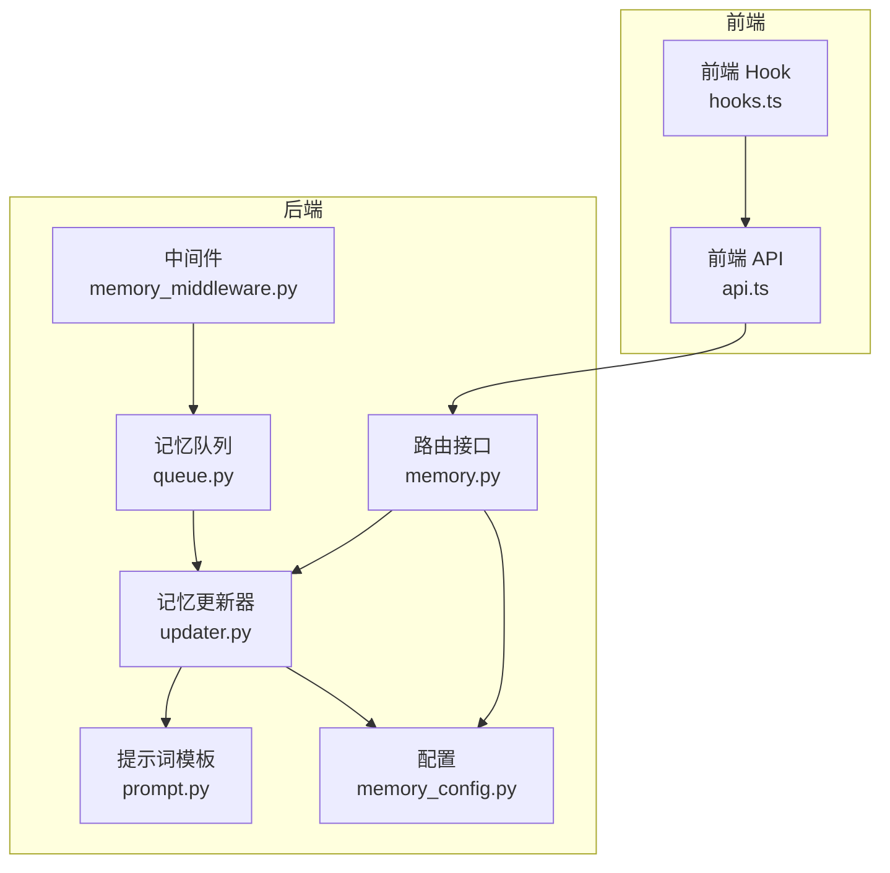
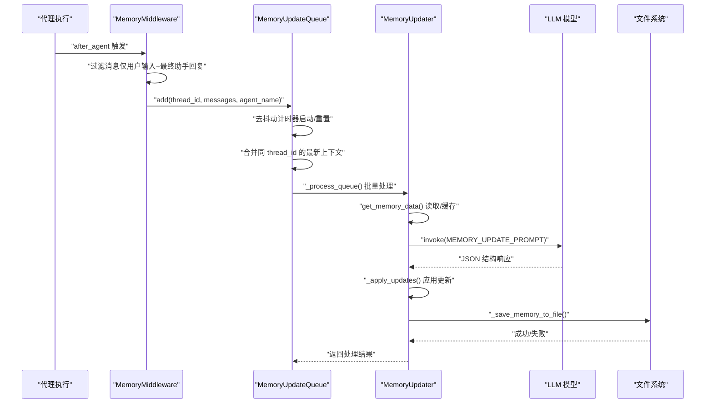
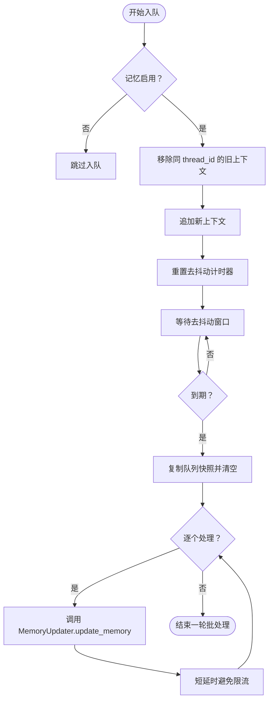
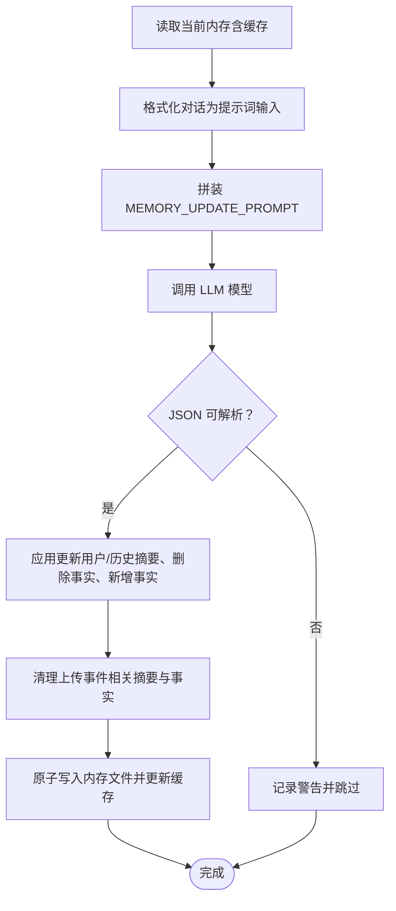
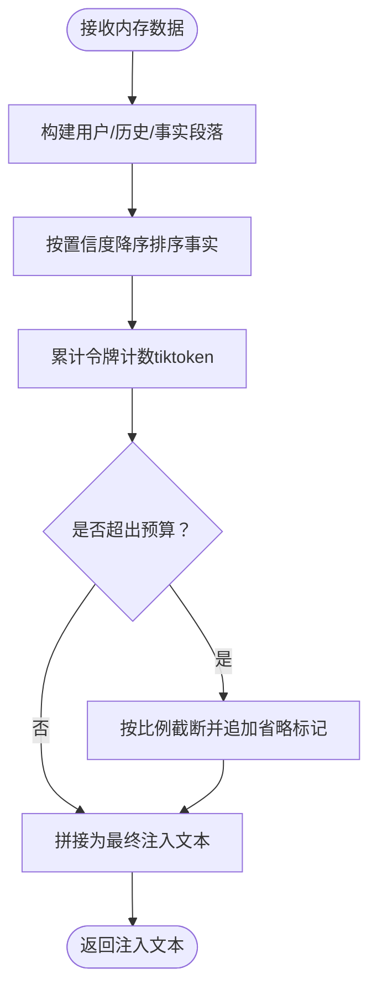
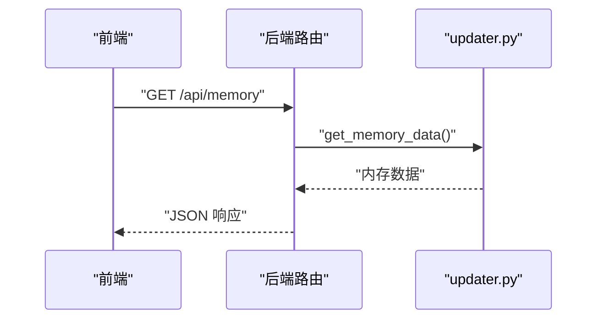
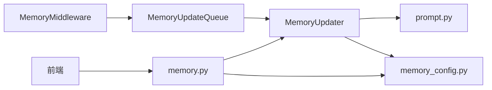

# 长期记忆系统

<cite>
**本文引用的文件**
- [queue.py](file://backend/packages/harness/deerflow/agents/memory/queue.py)
- [updater.py](file://backend/packages/harness/deerflow/agents/memory/updater.py)
- [prompt.py](file://backend/packages/harness/deerflow/agents/memory/prompt.py)
- [memory_config.py](file://backend/packages/harness/deerflow/config/memory_config.py)
- [memory_middleware.py](file://backend/packages/harness/deerflow/agents/middlewares/memory_middleware.py)
- [memory.py](file://backend/app/gateway/routers/memory.py)
- [api.ts](file://frontend/src/core/memory/api.ts)
- [hooks.ts](file://frontend/src/core/memory/hooks.ts)
- [MEMORY_IMPROVEMENTS.md](file://backend/docs/MEMORY_IMPROVEMENTS.md)
- [MEMORY_IMPROVEMENTS_SUMMARY.md](file://backend/docs/MEMORY_IMPROVEMENTS_SUMMARY.md)
</cite>

## 目录
1. [简介](#简介)
2. [项目结构](#项目结构)
3. [核心组件](#核心组件)
4. [架构总览](#架构总览)
5. [详细组件分析](#详细组件分析)
6. [依赖关系分析](#依赖关系分析)
7. [性能考量](#性能考量)
8. [故障排查指南](#故障排查指南)
9. [结论](#结论)
10. [附录](#附录)

## 简介
本技术文档面向长期记忆系统，围绕“记忆提取与存储”“自动上下文分析”“结构化数据存储”“去抖动更新策略”“记忆队列管理（消息过滤、批处理、优先级）”“记忆更新器工作原理（LLM 驱动内容提取、置信度评分、缓存失效）”等主题进行深入解析，并提供配置示例与性能优化建议，涵盖存储格式、查询策略与隐私保护措施。

## 项目结构
长期记忆系统由后端 Python 模块与前端 React 组件协同构成：
- 后端核心模块
  - 记忆队列：负责收集与批处理记忆更新请求，采用去抖动策略避免频繁写入
  - 记忆更新器：基于 LLM 对对话进行事实抽取与摘要更新，支持置信度阈值与事实上限
  - 提示词模板：定义记忆更新与注入的提示词结构，确保输出可解析
  - 中间件：在代理执行完成后过滤消息并入队，保证只记录最终用户输入与助手回复
  - 路由接口：提供内存数据查询、重载与状态查看的 API
  - 配置：集中管理启用开关、存储路径、去抖动时长、模型名、最大事实数、置信度阈值、注入开关与令牌预算
- 前端模块
  - 使用 React Query 获取记忆数据，通过统一 API 接口访问后端

图表来源
- [memory_middleware.py:86-150](file://backend/packages/harness/deerflow/agents/middlewares/memory_middleware.py#L86-L150)
- [queue.py:22-196](file://backend/packages/harness/deerflow/agents/memory/queue.py#L22-L196)
- [updater.py:267-443](file://backend/packages/harness/deerflow/agents/memory/updater.py#L267-L443)
- [prompt.py:14-341](file://backend/packages/harness/deerflow/agents/memory/prompt.py#L14-L341)
- [memory_config.py:6-79](file://backend/packages/harness/deerflow/config/memory_config.py#L6-L79)
- [memory.py:1-202](file://backend/app/gateway/routers/memory.py#L1-L202)

章节来源
- [memory_middleware.py:1-150](file://backend/packages/harness/deerflow/agents/middlewares/memory_middleware.py#L1-L150)
- [queue.py:1-196](file://backend/packages/harness/deerflow/agents/memory/queue.py#L1-L196)
- [updater.py:1-443](file://backend/packages/harness/deerflow/agents/memory/updater.py#L1-L443)
- [prompt.py:1-341](file://backend/packages/harness/deerflow/agents/memory/prompt.py#L1-L341)
- [memory_config.py:1-79](file://backend/packages/harness/deerflow/config/memory_config.py#L1-L79)
- [memory.py:1-202](file://backend/app/gateway/routers/memory.py#L1-L202)
- [api.ts:1-9](file://frontend/src/core/memory/api.ts#L1-L9)
- [hooks.ts:1-11](file://frontend/src/core/memory/hooks.ts#L1-L11)

## 核心组件
- 记忆队列（MemoryUpdateQueue）
  - 去抖动批处理：在配置的去抖动窗口内合并多次更新，减少 LLM 调用与磁盘写入
  - 线程安全：使用锁与定时器，避免并发冲突
  - 单例全局实例：通过全局函数获取，便于跨模块复用
- 记忆更新器（MemoryUpdater）
  - LLM 驱动的事实抽取与摘要更新：根据提示词模板生成 JSON，解析后应用到内存结构
  - 置信度评分与事实上限：仅保留高置信度事实，超过上限按置信度降序裁剪
  - 缓存失效：基于文件修改时间的内存缓存，文件变更即刷新
  - 上传事件清理：去除与上传相关的句子，避免未来会话中出现不存在的文件引用
- 提示词模板（prompt.py）
  - 定义记忆更新与注入的结构化提示，包含用户上下文、历史与事实抽取规则
  - 注入时的令牌预算控制：使用 tiktoken 进行精确计数，不足时截断
- 中间件（MemoryMiddleware）
  - 执行后过滤消息：仅保留用户输入与最终助手回复，剔除工具调用中间结果与上传临时块
  - 入队触发：将过滤后的对话上下文提交至队列，等待去抖动处理
- 路由接口（memory.py）
  - 提供获取记忆、重载记忆、获取配置与状态的 API
- 配置（memory_config.py）
  - 开关与参数：启用/禁用、存储路径、去抖动秒数、模型名、最大事实数、置信度阈值、注入开关与令牌预算
- 前端（api.ts、hooks.ts）
  - 通过统一 API 获取记忆数据，使用 React Query 管理加载状态

章节来源
- [queue.py:22-196](file://backend/packages/harness/deerflow/agents/memory/queue.py#L22-L196)
- [updater.py:267-443](file://backend/packages/harness/deerflow/agents/memory/updater.py#L267-L443)
- [prompt.py:14-341](file://backend/packages/harness/deerflow/agents/memory/prompt.py#L14-L341)
- [memory_middleware.py:86-150](file://backend/packages/harness/deerflow/agents/middlewares/memory_middleware.py#L86-L150)
- [memory.py:1-202](file://backend/app/gateway/routers/memory.py#L1-L202)
- [memory_config.py:6-79](file://backend/packages/harness/deerflow/config/memory_config.py#L6-L79)
- [api.ts:1-9](file://frontend/src/core/memory/api.ts#L1-L9)
- [hooks.ts:1-11](file://frontend/src/core/memory/hooks.ts#L1-L11)

## 架构总览
以下序列图展示从代理执行完成到记忆更新的完整流程，包括消息过滤、队列入队、去抖动批处理与 LLM 更新：

图表来源
- [memory_middleware.py:108-149](file://backend/packages/harness/deerflow/agents/middlewares/memory_middleware.py#L108-L149)
- [queue.py:37-130](file://backend/packages/harness/deerflow/agents/memory/queue.py#L37-L130)
- [updater.py:284-348](file://backend/packages/harness/deerflow/agents/memory/updater.py#L284-L348)
- [prompt.py:14-117](file://backend/packages/harness/deerflow/agents/memory/prompt.py#L14-L117)

## 详细组件分析

### 记忆队列（去抖动与批处理）
- 设计要点
  - 去抖动窗口：同一 thread_id 在配置时间内收到新上下文则替换旧队列项，避免重复处理
  - 批处理：到期后复制队列快照，清空队列，逐条调用更新器，条间加入小延迟以规避限流
  - 并发控制：锁保护与 processing 标志防止并发处理；定时器取消与重启保证一致性
  - 单例：全局唯一实例，支持测试重置
- 关键行为
  - add：入队并重置计时器
  - _process_queue：批量处理并调用 MemoryUpdater.update_memory
  - flush/clear：强制立即处理或清空队列
  - 属性：pending_count/is_processing

图表来源
- [queue.py:37-130](file://backend/packages/harness/deerflow/agents/memory/queue.py#L37-L130)

章节来源
- [queue.py:22-196](file://backend/packages/harness/deerflow/agents/memory/queue.py#L22-L196)

### 记忆更新器（LLM 驱动的事实抽取与摘要更新）
- 数据结构
  - 内存文件结构：版本号、最后更新时间、用户上下文（工作、个人、当前关注）、历史（近月、早期、长期背景）、事实列表
- 处理流程
  - 读取当前内存：带文件修改时间的缓存，文件变化自动刷新
  - 构造提示词：将对话格式化为固定结构文本，注入当前内存状态
  - LLM 调用：调用指定模型，解析 JSON 响应
  - 应用更新：更新用户与历史摘要、删除指定事实、添加新事实（满足置信度阈值且不重复）
  - 清理上传事件：去除与上传相关的句子，避免未来会话中出现不存在的文件引用
  - 保存：原子写入（临时文件+重命名），更新缓存与文件修改时间
- 置信度与事实上限
  - 新增事实需达到阈值才入库
  - 超出上限按置信度降序保留前 N 个
- 错误处理
  - JSON 解析失败、异常捕获与日志记录，避免中断后续处理

图表来源
- [updater.py:284-348](file://backend/packages/harness/deerflow/agents/memory/updater.py#L284-L348)
- [prompt.py:14-117](file://backend/packages/harness/deerflow/agents/memory/prompt.py#L14-L117)

章节来源
- [updater.py:267-443](file://backend/packages/harness/deerflow/agents/memory/updater.py#L267-L443)
- [prompt.py:14-117](file://backend/packages/harness/deerflow/agents/memory/prompt.py#L14-L117)

### 自动上下文分析与注入
- 上下文分析
  - MemoryMiddleware 在代理执行后过滤消息，仅保留用户输入与最终助手回复，剔除工具调用中间结果与上传临时块
  - 过滤逻辑：正则剥离上传块；若剥离后为空，则整对（用户+助手）被丢弃
- 注入策略
  - format_memory_for_injection 将用户上下文、历史与事实（按置信度降序）拼接为字符串
  - 使用 tiktoken 精确计数，不足时按比例截断，确保不超过 max_injection_tokens
  - 当前未实现 TF-IDF 相似度检索，计划中将引入相似度与置信度加权排序

图表来源
- [prompt.py:186-294](file://backend/packages/harness/deerflow/agents/memory/prompt.py#L186-L294)
- [MEMORY_IMPROVEMENTS.md:13-56](file://backend/docs/MEMORY_IMPROVEMENTS.md#L13-L56)

章节来源
- [memory_middleware.py:20-83](file://backend/packages/harness/deerflow/agents/middlewares/memory_middleware.py#L20-L83)
- [prompt.py:186-294](file://backend/packages/harness/deerflow/agents/memory/prompt.py#L186-L294)
- [MEMORY_IMPROVEMENTS.md:1-66](file://backend/docs/MEMORY_IMPROVEMENTS.md#L1-L66)
- [MEMORY_IMPROVEMENTS_SUMMARY.md:1-39](file://backend/docs/MEMORY_IMPROVEMENTS_SUMMARY.md#L1-L39)

### API 与前端集成
- 后端路由
  - GET /api/memory：返回当前内存数据
  - POST /api/memory/reload：强制从文件重载内存并刷新缓存
  - GET /api/memory/config：返回当前配置
  - GET /api/memory/status：同时返回配置与数据
- 前端
  - hooks.ts 使用 React Query 查询记忆数据
  - api.ts 发起请求到后端 /api/memory

图表来源
- [memory.py:75-116](file://backend/app/gateway/routers/memory.py#L75-L116)
- [api.ts:5-9](file://frontend/src/core/memory/api.ts#L5-L9)
- [hooks.ts:5-10](file://frontend/src/core/memory/hooks.ts#L5-L10)

章节来源
- [memory.py:1-202](file://backend/app/gateway/routers/memory.py#L1-L202)
- [api.ts:1-9](file://frontend/src/core/memory/api.ts#L1-L9)
- [hooks.ts:1-11](file://frontend/src/core/memory/hooks.ts#L1-L11)

## 依赖关系分析
- 组件耦合
  - MemoryMiddleware 依赖 MemoryUpdateQueue（单例）与配置
  - MemoryUpdateQueue 依赖 MemoryUpdater（运行时导入以避免循环依赖）
  - MemoryUpdater 依赖提示词模板、配置、模型工厂与路径配置
  - 路由层依赖 updater 与配置，提供对外 API
- 外部依赖
  - LLM 模型：通过模型工厂创建
  - tiktoken：用于注入时的令牌精确计数
  - 文件系统：内存文件的读写与原子替换

图表来源
- [memory_middleware.py:10-11](file://backend/packages/harness/deerflow/agents/middlewares/memory_middleware.py#L10-L11)
- [queue.py:86-87](file://backend/packages/harness/deerflow/agents/memory/queue.py#L86-L87)
- [updater.py:11-17](file://backend/packages/harness/deerflow/agents/memory/updater.py#L11-L17)
- [memory.py:6-7](file://backend/app/gateway/routers/memory.py#L6-L7)

章节来源
- [memory_middleware.py:1-150](file://backend/packages/harness/deerflow/agents/middlewares/memory_middleware.py#L1-L150)
- [queue.py:1-196](file://backend/packages/harness/deerflow/agents/memory/queue.py#L1-L196)
- [updater.py:1-443](file://backend/packages/harness/deerflow/agents/memory/updater.py#L1-L443)
- [memory.py:1-202](file://backend/app/gateway/routers/memory.py#L1-L202)

## 性能考量
- 去抖动批处理
  - 合理设置 debounce_seconds，平衡实时性与吞吐量
  - 批处理内部对多条更新加入短延时，避免 LLM 限流
- 缓存与文件 I/O
  - 基于文件修改时间的内存缓存减少重复读取
  - 原子写入（临时文件+重命名）降低损坏风险
- 注入令牌预算
  - format_memory_for_injection 使用 tiktoken 精确计数，避免超预算导致截断过多
  - max_injection_tokens 可根据模型上下文长度限制调整
- 置信度与事实上限
  - 通过 fact_confidence_threshold 与 max_facts 控制事实规模，提升检索效率
- 潜在优化方向
  - 引入 TF-IDF 相似度召回与置信度加权排序（计划中）

章节来源
- [queue.py:66-82](file://backend/packages/harness/deerflow/agents/memory/queue.py#L66-L82)
- [updater.py:225-265](file://backend/packages/harness/deerflow/agents/memory/updater.py#L225-L265)
- [prompt.py:186-294](file://backend/packages/harness/deerflow/agents/memory/prompt.py#L186-L294)
- [MEMORY_IMPROVEMENTS.md:13-56](file://backend/docs/MEMORY_IMPROVEMENTS.md#L13-L56)

## 故障排查指南
- 记忆未更新
  - 检查 MemoryMiddleware 是否在代理执行后被调用，确认 thread_id 是否存在
  - 查看队列 pending_count 与 is_processing 状态
  - 确认配置 enabled 与 debounce_seconds 设置合理
- LLM 响应解析失败
  - 检查 MEMORY_UPDATE_PROMPT 输出是否为合法 JSON
  - 关注日志中的 JSON 解析错误信息
- 注入内容为空或过短
  - 检查 max_injection_tokens 设置是否过低
  - 确认 format_memory_for_injection 的令牌计数逻辑是否可用（tiktoken）
- 上传相关问题
  - 确认上传块已被正确剥离，避免未来会话中出现不存在的文件引用
- API 返回异常
  - 使用 /api/memory/status 检查配置与数据状态
  - 必要时调用 /api/memory/reload 强制重载

章节来源
- [memory_middleware.py:108-149](file://backend/packages/harness/deerflow/agents/middlewares/memory_middleware.py#L108-L149)
- [queue.py:155-166](file://backend/packages/harness/deerflow/agents/memory/queue.py#L155-L166)
- [updater.py:343-348](file://backend/packages/harness/deerflow/agents/memory/updater.py#L343-L348)
- [prompt.py:186-294](file://backend/packages/harness/deerflow/agents/memory/prompt.py#L186-L294)
- [memory.py:175-201](file://backend/app/gateway/routers/memory.py#L175-L201)

## 结论
长期记忆系统通过“消息过滤 + 去抖动批处理 + LLM 驱动的事实抽取与摘要更新 + 注入令牌预算控制”的组合，实现了稳定、可扩展的记忆能力。当前已具备准确的令牌计数与事实置信度管理，计划中的 TF-IDF 相似度召回将进一步提升检索质量。建议结合业务场景调整去抖动窗口、事实上限与注入预算，并在需要时引入 per-agent 内存隔离与更细粒度的隐私控制。

## 附录

### 配置示例与最佳实践
- 存储路径
  - storage_path 支持绝对路径与相对路径（相对于 base_dir），迁移时注意路径解析差异
- 去抖动时长
  - debounce_seconds 建议 30–60 秒，兼顾实时性与吞吐
- 最大事实数与置信度阈值
  - max_facts 建议 100–200，fact_confidence_threshold 建议 0.7–0.8
- 注入预算
  - max_injection_tokens 建议 2000–4000，依据模型上下文长度调整
- 模型选择
  - model_name 可指定具体模型；未指定时使用默认模型
- per-agent 内存
  - 通过 agent_name 参数区分全局与每代理内存文件

章节来源
- [memory_config.py:6-79](file://backend/packages/harness/deerflow/config/memory_config.py#L6-L79)
- [updater.py:22-41](file://backend/packages/harness/deerflow/agents/memory/updater.py#L22-L41)

### 查询策略与隐私保护
- 查询策略
  - 当前按置信度降序注入，未来可引入 TF-IDF 与置信度加权排序
  - 建议在检索阶段也采用相同权重策略，提升相关性
- 隐私保护
  - 自动剥离上传事件相关描述，避免泄露临时文件路径
  - 建议在生产环境对存储文件进行访问控制与定期审计

章节来源
- [updater.py:193-213](file://backend/packages/harness/deerflow/agents/memory/updater.py#L193-L213)
- [MEMORY_IMPROVEMENTS.md:13-56](file://backend/docs/MEMORY_IMPROVEMENTS.md#L13-L56)