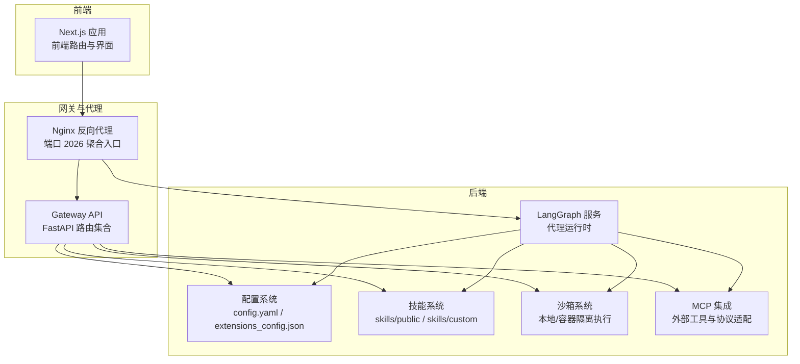
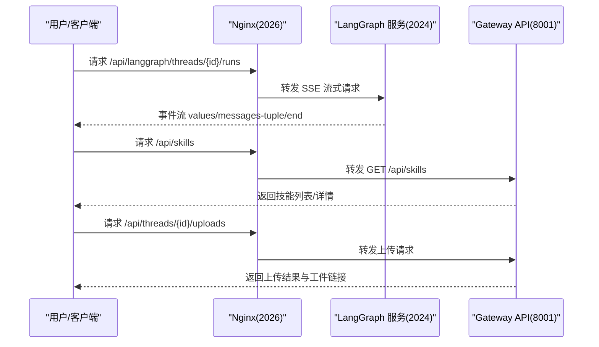
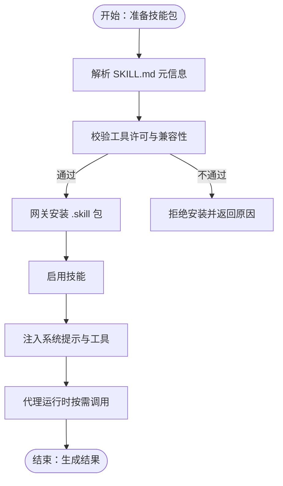
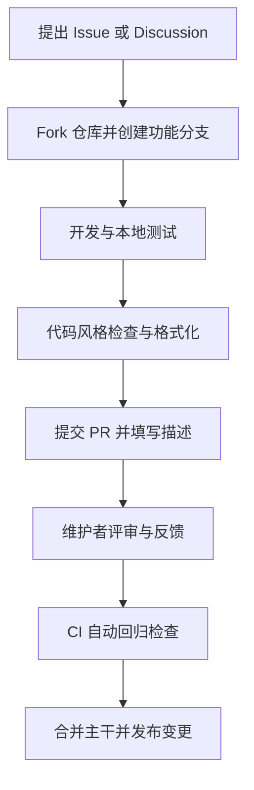
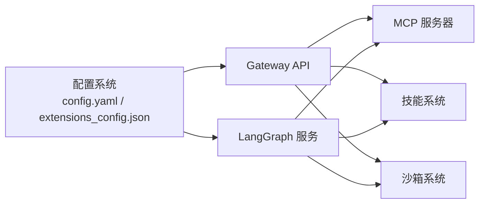

# 社区生态

<cite>
**本文引用的文件**
- [README.md](file://README.md)
- [CONTRIBUTING.md](file://CONTRIBUTING.md)
- [backend/README.md](file://backend/README.md)
- [backend/docs/README.md](file://backend/docs/README.md)
- [backend/docs/CONFIGURATION.md](file://backend/docs/CONFIGURATION.md)
- [backend/docs/API.md](file://backend/docs/API.md)
- [backend/docs/ARCHITECTURE.md](file://backend/docs/ARCHITECTURE.md)
- [backend/docs/MCP_SERVER.md](file://backend/docs/MCP_SERVER.md)
- [frontend/README.md](file://frontend/README.md)
- [SECURITY.md](file://SECURITY.md)
</cite>

## 目录
1. [引言](#引言)
2. [项目结构](#项目结构)
3. [核心组件](#核心组件)
4. [架构总览](#架构总览)
5. [详细组件分析](#详细组件分析)
6. [依赖关系分析](#依赖关系分析)
7. [性能与可扩展性](#性能与可扩展性)
8. [故障排查指南](#故障排查指南)
9. [结论](#结论)
10. [附录：参与方式与贡献路径](#附录参与方式与贡献路径)

## 引言
本章节面向希望参与 DeerFlow 社区建设与生态扩展的开发者，系统介绍项目的开源社区文化、贡献者协作模式、治理与贡献流程、代码规范，以及技能市场与第三方集成的运作方式。同时提供文档、教程、示例与讨论渠道指引，并给出致谢与鸣谢，体现开源协作价值。

## 项目结构
DeerFlow 采用前后端分离与多语言混合的工程化组织方式：
- 后端（Python）：基于 LangGraph/LangChain 的代理运行时、网关 API、沙箱执行、工具与技能系统等。
- 前端（Next.js）：现代化 Web 界面，提供聊天、工作区、设置等功能。
- 文档（docs/）：后端技术文档与 API 参考，覆盖架构、配置、API、文件上传、计划模式等主题。
- 技能（skills/public 与 skills/custom）：可插拔的能力模块，支持安装、启用与禁用。
- 配置（config.yaml 与 extensions_config.json）：统一管理模型、工具、沙箱、MCP 服务器与技能状态。
- 开发与部署（Makefile、Docker、Nginx）：提供一键开发与生产部署能力。

图表来源
- [backend/docs/ARCHITECTURE.md:7-51](file://backend/docs/ARCHITECTURE.md#L7-L51)
- [backend/docs/API.md:7-12](file://backend/docs/API.md#L7-L12)
- [backend/docs/CONFIGURATION.md:203-231](file://backend/docs/CONFIGURATION.md#L203-L231)

章节来源
- [backend/README.md:214-250](file://backend/README.md#L214-L250)
- [frontend/README.md:76-107](file://frontend/README.md#L76-L107)
- [backend/docs/README.md:39-53](file://backend/docs/README.md#L39-L53)

## 核心组件
- 代理运行时与中间件链：Lead Agent 作为统一入口，串联线程数据、上传注入、沙箱获取、摘要、任务清单、标题生成、记忆、图像注入与澄清处理等中间件。
- 网关 API：提供模型、MCP、技能、上传、工件、会话清理等 REST 接口，统一前端调用。
- 沙箱系统：抽象接口与本地/容器提供者，虚拟路径映射到线程隔离目录，支持 bash、文件读写等工具。
- 工具与技能：内置工具、社区工具、MCP 工具与可插拔技能，按需加载并注入系统提示。
- 配置与扩展：集中式配置与扩展配置，支持模型、工具组、沙箱、MCP 服务器与技能状态管理。

章节来源
- [backend/README.md:44-136](file://backend/README.md#L44-L136)
- [backend/docs/ARCHITECTURE.md:96-127](file://backend/docs/ARCHITECTURE.md#L96-L127)
- [backend/docs/API.md:153-506](file://backend/docs/API.md#L153-L506)

## 架构总览
DeerFlow 通过 Nginx 统一入口分发请求至 LangGraph 与 Gateway；LangGraph 负责代理交互与流式输出，Gateway 提供非代理类操作的 REST 能力。配置系统贯穿两端，MCP 与技能系统在运行期动态注入工具与能力。

图表来源
- [backend/docs/ARCHITECTURE.md:344-380](file://backend/docs/ARCHITECTURE.md#L344-L380)
- [backend/docs/API.md:14-12](file://backend/docs/API.md#L14-L12)

章节来源
- [backend/docs/ARCHITECTURE.md:7-51](file://backend/docs/ARCHITECTURE.md#L7-L51)
- [backend/docs/API.md:14-12](file://backend/docs/API.md#L14-L12)

## 详细组件分析

### 技能市场与第三方集成
- 技能市场运作机制
  - 技能以标准 Markdown 文件（含元信息）形式存在，位于公共或自定义目录，按需加载并注入系统提示。
  - 支持安装外部 .skill 归档并通过网关进行启用/禁用管理。
  - 元信息字段用于版本、作者、兼容性等声明，便于生态治理与质量控制。
- 第三方集成可能性
  - MCP 服务器：通过扩展配置启用 HTTP/SSE/stdio 类型的 MCP 服务器，支持 OAuth 客户端凭证与刷新令牌流程，实现数据库、文件系统、外部 API、浏览器自动化等能力接入。
  - 社区工具：内置 Tavily、Jina AI、Firecrawl 等工具，亦可通过 MCP 扩展更多来源。
- 生态扩展建议
  - 以标准化 SKILL.md 元信息与最小工具集为边界，确保可移植性与安全性。
  - 通过网关 API 对外暴露统一能力，避免直接耦合底层实现。

图表来源
- [backend/docs/API.md:363-386](file://backend/docs/API.md#L363-L386)
- [backend/docs/CONFIGURATION.md:256-274](file://backend/docs/CONFIGURATION.md#L256-L274)

章节来源
- [backend/docs/API.md:281-386](file://backend/docs/API.md#L281-L386)
- [backend/docs/MCP_SERVER.md:1-65](file://backend/docs/MCP_SERVER.md#L1-L65)
- [backend/docs/CONFIGURATION.md:256-274](file://backend/docs/CONFIGURATION.md#L256-L274)

### 治理模式与贡献流程
- 治理模式
  - 采用开放协作与透明决策：Issue/PR 流程、文档与测试驱动、CI 回归检查。
  - 配置与扩展文件作为“契约”：config.yaml 与 extensions_config.json 作为跨组件共享的治理边界。
- 贡献流程
  - 分支命名、提交信息格式、测试与 Lint、PR 描述模板与评审流程均有明确规范。
  - 后端与前端分别提供独立的贡献指南与开发命令，降低协作门槛。
- 代码规范
  - 后端使用 ruff 进行 Lint 与格式化；前端使用 ESLint 与 Prettier。
  - Python 使用类型注解、最大行长、引号与缩进约定；TS 使用类型检查与脚本命令。

图表来源
- [CONTRIBUTING.md:244-266](file://CONTRIBUTING.md#L244-L266)
- [backend/CONTRIBUTING.md:243-266](file://backend/CONTRIBUTING.md#L243-L266)

章节来源
- [CONTRIBUTING.md:244-266](file://CONTRIBUTING.md#L244-L266)
- [backend/CONTRIBUTING.md:129-151](file://backend/CONTRIBUTING.md#L129-L151)

### 社区资源与参与渠道
- 官方网站与演示：提供实时演示与产品介绍，便于新用户快速上手。
- 文档与教程：后端文档涵盖架构、API、配置、文件上传、计划模式等；前端 README 提供技术栈与开发步骤。
- 示例项目：skills/public 下包含多种领域示例（研究、报告、可视化、图像生成、视频生成、PPT、播客等），可直接安装与体验。
- 讨论与反馈：通过 Issues、Discussions 与安全漏洞通道进行沟通与上报。

章节来源
- [README.md:23-75](file://README.md#L23-L75)
- [backend/docs/README.md:1-54](file://backend/docs/README.md#L1-L54)
- [frontend/README.md:1-131](file://frontend/README.md#L1-L131)

## 依赖关系分析
- 组件耦合
  - LangGraph 与 Gateway 通过 Nginx 解耦，便于独立演进与扩容。
  - 配置系统在两端共享，形成强一致的运行期契约。
  - MCP 与技能系统作为“插件层”，对核心代理运行时保持低耦合。
- 外部依赖
  - LangChain/LangGraph 提供代理与工具抽象；FastAPI 提供网关 API；Nginx 提供反向代理与流式支持。
- 潜在风险
  - 配置版本升级与迁移需谨慎；MCP 服务器的凭据与网络访问需受控。

图表来源
- [backend/docs/ARCHITECTURE.md:42-51](file://backend/docs/ARCHITECTURE.md#L42-L51)
- [backend/docs/CONFIGURATION.md:256-274](file://backend/docs/CONFIGURATION.md#L256-L274)

章节来源
- [backend/docs/ARCHITECTURE.md:42-51](file://backend/docs/ARCHITECTURE.md#L42-L51)
- [backend/docs/CONFIGURATION.md:256-274](file://backend/docs/CONFIGURATION.md#L256-L274)

## 性能与可扩展性
- 性能特性
  - SSE 流式传输降低首 token 时间，提升长任务可见性。
  - 中间件链按序执行，支持摘要与上下文压缩，避免超限。
  - MCP 工具缓存与配置 mtime 失效，减少重复初始化开销。
- 可扩展性
  - MCP 与技能系统按需加载，避免全局膨胀。
  - 沙箱提供者可替换（本地/容器），满足不同隔离与安全需求。
  - 网关 API 与 LangGraph API 分离，便于横向扩展与灰度发布。

章节来源
- [backend/docs/ARCHITECTURE.md:466-484](file://backend/docs/ARCHITECTURE.md#L466-L484)
- [backend/docs/API.md:539-551](file://backend/docs/API.md#L539-L551)

## 故障排查指南
- 配置问题
  - 配置文件未找到：确认 config.yaml 位于项目根目录或通过环境变量指定路径。
  - API 密钥无效：检查环境变量是否正确设置与引用。
  - 技能未加载：确认 SKILL.md 存在且路径映射正确。
- 沙箱启动失败
  - 确认 Docker 正常运行、端口可用、镜像可达。
- 安全与合规
  - 生产部署建议增加认证与限流策略；敏感凭据通过环境变量传递。

章节来源
- [backend/docs/CONFIGURATION.md:326-346](file://backend/docs/CONFIGURATION.md#L326-L346)
- [SECURITY.md:1-13](file://SECURITY.md#L1-L13)

## 结论
DeerFlow 以开放、可扩展、可治理为核心理念，构建了“代理运行时 + 网关 API + 沙箱执行 + 技能与 MCP 扩展”的完整生态闭环。通过清晰的贡献流程、统一的配置契约与完善的文档体系，社区成员可以高效地参与开发、集成与生态共建。

## 附录：参与方式与贡献路径
- 快速开始
  - 阅读贡献指南与前后端 README，选择 Docker 或本地开发环境。
  - 配置模型与 API 密钥，启动服务并访问 Web 界面。
- 贡献方向
  - 后端：新增工具、中间件、API 路由、配置项与测试。
  - 前端：界面优化、国际化、SDK 与集成示例。
  - 技能：编写领域技能、完善示例与文档。
  - 文档：补充架构、配置与 API 说明。
- 提交与评审
  - 遵循分支命名、提交信息格式与测试要求；通过 PR 描述清晰说明动机、方法与验证。
- 社区互动
  - 通过 Issues/Discussions 反馈问题与建议；关注安全漏洞通道。

章节来源
- [CONTRIBUTING.md:5-305](file://CONTRIBUTING.md#L5-L305)
- [backend/README.md:317-377](file://backend/README.md#L317-L377)
- [frontend/README.md:11-131](file://frontend/README.md#L11-L131)
- [backend/docs/README.md:1-54](file://backend/docs/README.md#L1-L54)