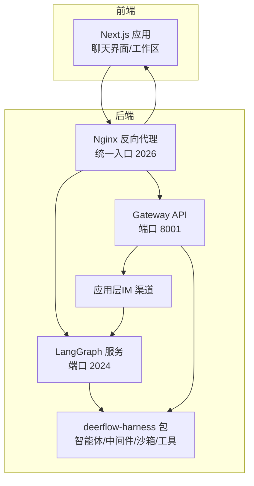
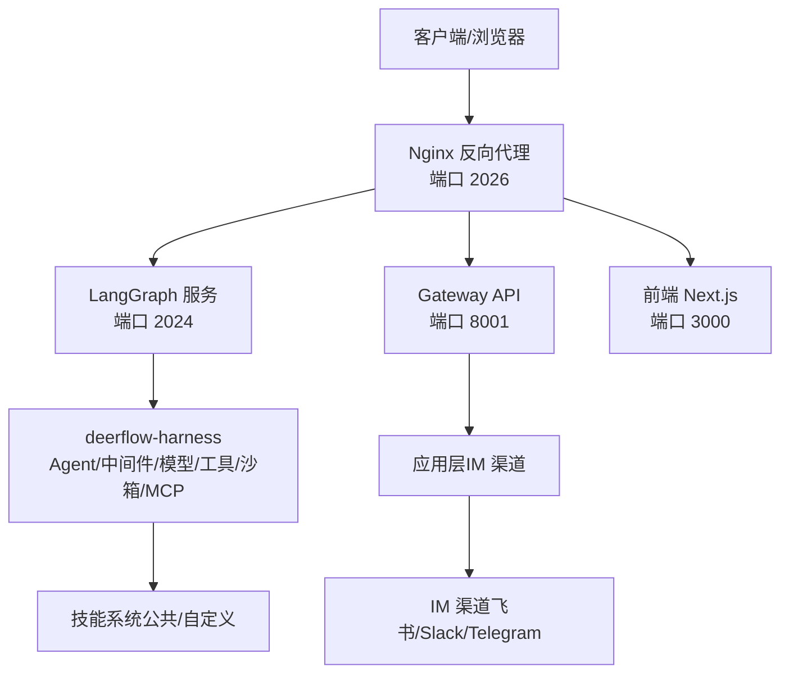
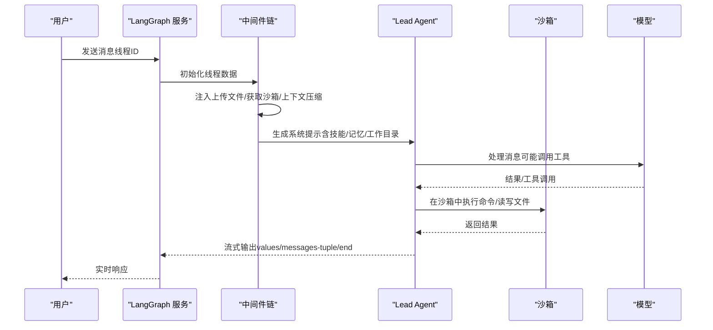
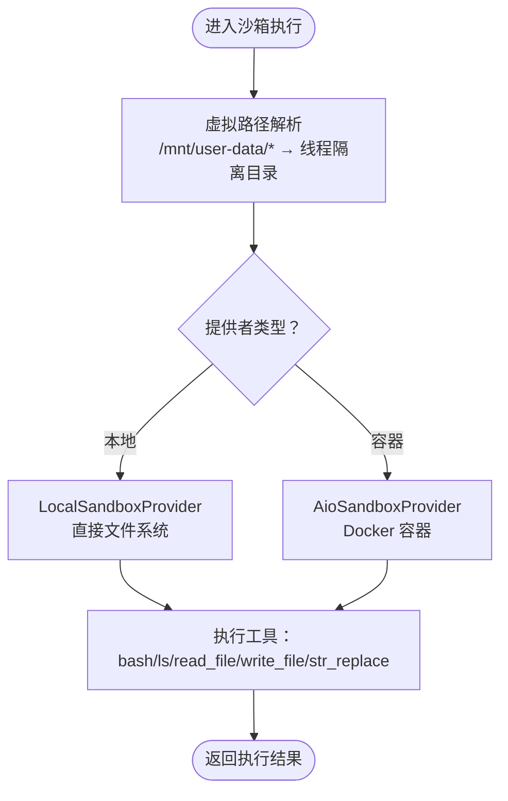
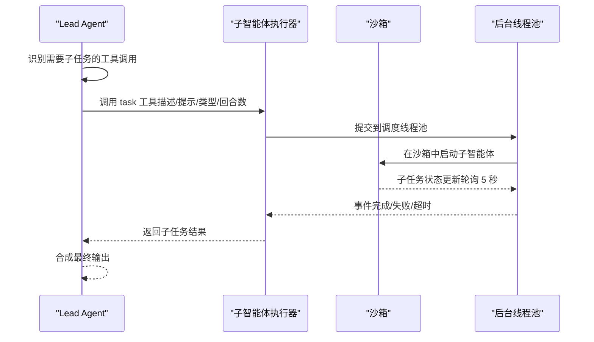
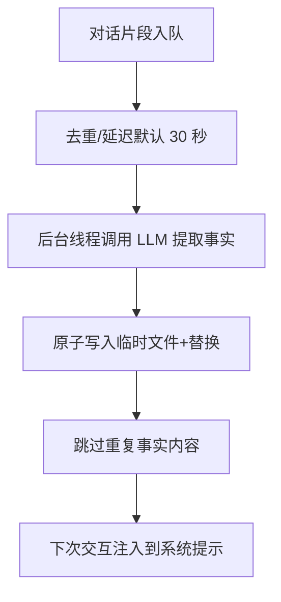
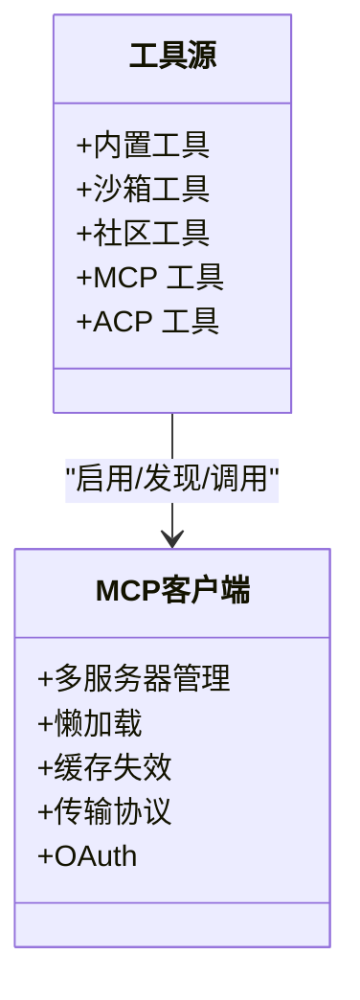
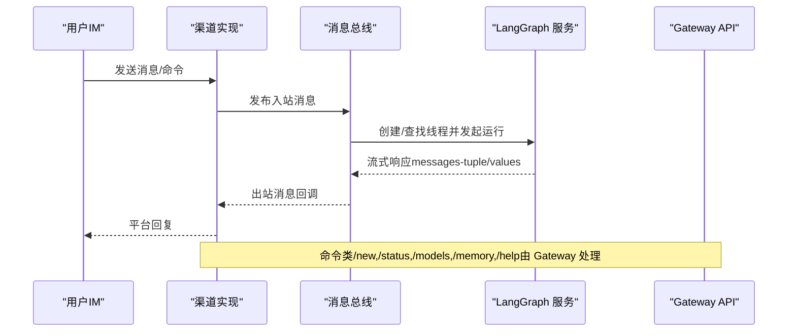
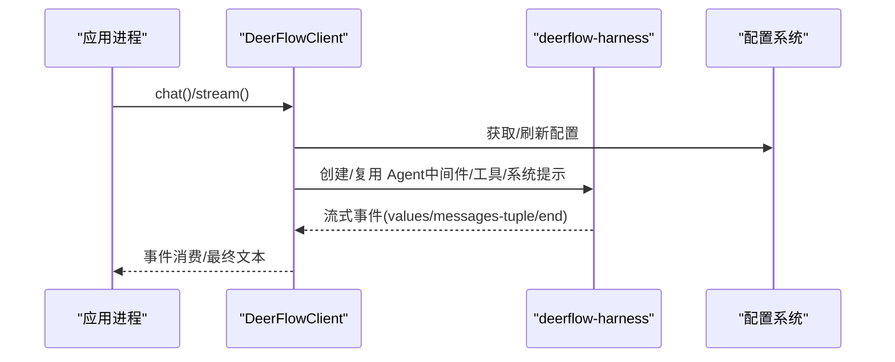
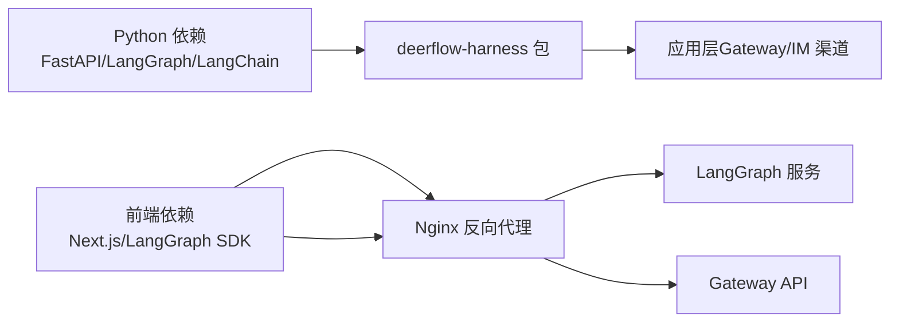

# 项目介绍

<cite>
**本文引用的文件**
- [README.md](file://README.md)
- [backend/README.md](file://backend/README.md)
- [backend/CLAUDE.md](file://backend/CLAUDE.md)
- [backend/docs/ARCHITECTURE.md](file://backend/docs/ARCHITECTURE.md)
- [backend/pyproject.toml](file://backend/pyproject.toml)
- [frontend/README.md](file://frontend/README.md)
- [frontend/package.json](file://frontend/package.json)
- [backend/packages/harness/deerflow/client.py](file://backend/packages/harness/deerflow/client.py)
- [backend/packages/harness/deerflow/agents/__init__.py](file://backend/packages/harness/deerflow/agents/__init__.py)
- [backend/packages/harness/deerflow/config/app_config.py](file://backend/packages/harness/deerflow/config/app_config.py)
- [skills/public/deep-research/README.md](file://skills/public/deep-research/README.md)
- [skills/public/deep-research/SKILL.md](file://skills/public/deep-research/SKILL.md)
- [skills/public/data-analysis/SKILL.md](file://skills/public/data-analysis/SKILL.md)
- [skills/public/image-generation/SKILL.md](file://skills/public/image-generation/SKILL.md)
- [CONTRIBUTING.md](file://CONTRIBUTING.md)
</cite>

## 目录
1. [引言](#引言)
2. [项目结构](#项目结构)
3. [核心组件](#核心组件)
4. [架构总览](#架构总览)
5. [详细组件分析](#详细组件分析)
6. [依赖关系分析](#依赖关系分析)
7. [性能考量](#性能考量)
8. [故障排查指南](#故障排查指南)
9. [结论](#结论)
10. [附录](#附录)

## 引言
DeerFlow 是一个基于 LangGraph 的“超级智能体编排平台”，旨在将研究工具演进为可扩展、可生产的智能体基础设施。它通过“智能体 + 记忆 + 沙箱”的组合，提供可插拔的技能体系与多模态工具集，支持复杂任务的分解执行与长期记忆沉淀，并以隔离沙箱确保可审计、可复现的执行环境。

- 从 Deep Research 框架到“超级智能体编排平台”的演进：2.0 版本是完全重写的全新实现，不再仅是框架，而是“电池已内置、可自由扩展”的运行时平台。
- 技术愿景：以 LangGraph 为核心，结合 LangChain 工具链、FastAPI 网关、MCP 协议与社区生态，构建“可思考、可规划、可并行子任务委派”的智能体基础设施。
- 核心哲学：以“系统提示注入技能、中间件处理横切关注点、沙箱提供执行边界”为设计基石，兼顾易用性与工程化落地。

章节来源
- [README.md:12-17](file://README.md#L12-L17)
- [README.md:382-393](file://README.md#L382-L393)
- [backend/README.md:3-41](file://backend/README.md#L3-L41)

## 项目结构
项目采用前后端分离与“运行时包 + 应用层”的分层架构：
- 后端（Python）：LangGraph 服务、FastAPI 网关、IM 渠道桥接、配置与工具系统、沙箱与子智能体执行等。
- 前端（Next.js）：聊天界面、工作区、设置与多语言支持。
- 运行时包（deerflow-harness）：可发布为独立包，封装智能体编排、中间件、模型工厂、工具系统、沙箱与 MCP 集成等。
- 技能（skills）：公共与自定义技能目录，按需注入到系统提示中。

图表来源
- [backend/README.md:7-41](file://backend/README.md#L7-L41)
- [backend/docs/ARCHITECTURE.md:7-51](file://backend/docs/ARCHITECTURE.md#L7-L51)

章节来源
- [backend/README.md:214-250](file://backend/README.md#L214-L250)
- [frontend/README.md:76-107](file://frontend/README.md#L76-L107)
- [backend/pyproject.toml:1-29](file://backend/pyproject.toml#L1-L29)
- [frontend/package.json:1-111](file://frontend/package.json#L1-L111)

## 核心组件
- Lead Agent（主智能体）：动态模型选择、中间件链、工具系统、子智能体委派与系统提示注入。
- 中间件链：线性执行的横切关注点处理，包括会话数据初始化、上传文件注入、沙箱获取、上下文压缩、计划任务、标题生成、记忆队列、图像注入、澄清请求拦截等。
- 沙箱系统：抽象接口与本地/容器提供者，虚拟路径映射至线程隔离的工作空间。
- 子智能体系统：并发委派与后台执行，支持任务工具与事件流。
- 记忆系统：基于 LLM 的事实抽取与去重，结构化存储与提示注入。
- 工具生态：内置工具、社区工具（搜索/抓取/图像）、MCP 扩展与 ACP 兼容工具。
- 网关 API：REST 接口，提供模型、MCP、技能、内存、上传、工件与线程清理等能力。
- 嵌入式客户端：无需 HTTP 服务即可直接调用 DeerFlow 能力，返回与网关一致的数据结构。

章节来源
- [backend/README.md:44-136](file://backend/README.md#L44-L136)
- [backend/docs/ARCHITECTURE.md:96-127](file://backend/docs/ARCHITECTURE.md#L96-L127)
- [backend/docs/ARCHITECTURE.md:147-180](file://backend/docs/ARCHITECTURE.md#L147-L180)
- [backend/docs/ARCHITECTURE.md:191-218](file://backend/docs/ARCHITECTURE.md#L191-L218)
- [backend/docs/ARCHITECTURE.md:376-407](file://backend/docs/ARCHITECTURE.md#L376-L407)

## 架构总览
DeerFlow 的整体架构由“统一反向代理 + 多服务协同 + 运行时包 + 应用层 + 技能系统”构成。请求经 Nginx 路由到 LangGraph 或 Gateway；LangGraph 负责智能体运行与流式响应；Gateway 提供非智能体类操作；deerflow-harness 封装了 Agent、中间件、模型、工具、沙箱与 MCP；应用层负责 IM 渠道与路由；技能通过系统提示注入到智能体上下文中。

图表来源
- [backend/docs/ARCHITECTURE.md:7-51](file://backend/docs/ARCHITECTURE.md#L7-L51)
- [backend/CLAUDE.md:105-131](file://backend/CLAUDE.md#L105-L131)

章节来源
- [backend/docs/ARCHITECTURE.md:5-51](file://backend/docs/ARCHITECTURE.md#L5-L51)
- [backend/CLAUDE.md:105-131](file://backend/CLAUDE.md#L105-L131)

## 详细组件分析

### Lead Agent 与中间件链
Lead Agent 作为 LangGraph 的单一入口，负责：
- 动态模型选择与思维/视觉支持
- 中间件链顺序执行（严格顺序）
- 工具系统整合（沙箱/内置/MCP/社区/子智能体）
- 子智能体委派与并行执行
- 系统提示注入技能、记忆与工作目录指引

中间件职责概览（顺序执行）：
1) ThreadDataMiddleware：创建线程隔离目录（workspace/uploads/outputs）
2) UploadsMiddleware：注入新上传文件到对话上下文
3) SandboxMiddleware：获取沙箱环境
4) SummarizationMiddleware：接近令牌上限时进行上下文压缩（可选）
5) TodoListMiddleware：计划模式下的多步任务跟踪（可选）
6) TitleMiddleware：首次交换后自动生成对话标题
7) MemoryMiddleware：异步记忆提取队列
8) ViewImageMiddleware：为具备视觉能力的模型注入图像数据（条件性）
9) ClarificationMiddleware：拦截澄清请求并中断执行（必须位于最后）

图表来源
- [backend/README.md:56-71](file://backend/README.md#L56-L71)
- [backend/docs/ARCHITECTURE.md:344-380](file://backend/docs/ARCHITECTURE.md#L344-L380)

章节来源
- [backend/README.md:46-71](file://backend/README.md#L46-L71)
- [backend/docs/ARCHITECTURE.md:96-127](file://backend/docs/ARCHITECTURE.md#L96-L127)

### 沙箱系统与文件路径映射
- 抽象接口：execute_command/read_file/write_file/list_dir
- 提供者：LocalSandboxProvider（本地文件系统）与 AioSandboxProvider（容器）
- 虚拟路径映射：/mnt/user-data/{workspace,uploads,outputs} → 线程隔离物理目录；/mnt/skills → skills/ 目录
- 工具：bash、ls、read_file、write_file、str_replace
- 安全与隔离：路径遍历防护、容器隔离、文件操作校验

图表来源
- [backend/README.md:72-82](file://backend/README.md#L72-L82)
- [backend/docs/ARCHITECTURE.md:182-190](file://backend/docs/ARCHITECTURE.md#L182-L190)

章节来源
- [backend/README.md:72-82](file://backend/README.md#L72-L82)
- [backend/docs/ARCHITECTURE.md:147-180](file://backend/docs/ARCHITECTURE.md#L147-L180)

### 子智能体委派与并发执行
- 内置子智能体：通用型与 Bash 专家
- 并发限制：每轮最多 3 个子智能体，超时时间 15 分钟
- 执行流程：task 工具 → 后台线程池 → 轮询状态 → SSE 事件 → 返回结果
- 事件类型：task_started/task_running/task_completed/task_failed/task_timed_out

图表来源
- [backend/README.md:83-91](file://backend/README.md#L83-L91)
- [backend/docs/ARCHITECTURE.md:237-244](file://backend/docs/ARCHITECTURE.md#L237-L244)

章节来源
- [backend/README.md:83-91](file://backend/README.md#L83-L91)
- [backend/docs/ARCHITECTURE.md:237-244](file://backend/docs/ARCHITECTURE.md#L237-L244)

### 记忆系统与上下文工程
- 自动提取：分析对话中的用户上下文、事实与偏好
- 结构化存储：用户上下文、历史与置信度评分的事实
- 延迟更新：批量更新以减少 LLM 调用频率
- 上下文注入：在系统提示中注入“Top Facts + 上下文”
- 文件缓存：mtime 基础的缓存失效策略

图表来源
- [backend/README.md:92-101](file://backend/README.md#L92-L101)
- [backend/docs/ARCHITECTURE.md:323-351](file://backend/docs/ARCHITECTURE.md#L323-L351)

章节来源
- [backend/README.md:92-101](file://backend/README.md#L92-L101)
- [backend/docs/ARCHITECTURE.md:323-351](file://backend/docs/ARCHITECTURE.md#L323-L351)

### 工具生态与 MCP 集成
- 工具分类：沙箱工具（bash/ls/read_file/write_file/str_replace）、内置工具（present_files/ask_clarification/view_image/task）、社区工具（Tavily/Jina/Firecrawl/DuckDuckGo）、MCP 工具（任意 MCP 服务器）
- MCP 支持：多服务器管理、懒加载、mtime 缓存失效、传输协议（stdio/SSE/HTTP）、OAuth（client_credentials/refresh_token）
- ACP 兼容：外部 ACP 适配器调用，线程隔离工作区

图表来源
- [backend/README.md:102-111](file://backend/README.md#L102-L111)
- [backend/docs/ARCHITECTURE.md:267-303](file://backend/docs/ARCHITECTURE.md#L267-L303)

章节来源
- [backend/README.md:102-111](file://backend/README.md#L102-L111)
- [backend/docs/ARCHITECTURE.md:267-303](file://backend/docs/ARCHITECTURE.md#L267-L303)

### 网关 API 与 IM 渠道
- 网关路由：模型列表、MCP 配置、技能管理、内存查询/重载、文件上传/列表/删除、线程清理、工件服务、建议生成等
- IM 渠道：飞书/Slack/Telegram 桥接，通过 LangGraph SDK 与 LangGraph 服务通信，保持线程一致性

图表来源
- [backend/README.md:131-136](file://backend/README.md#L131-L136)
- [backend/CLAUDE.md:294-322](file://backend/CLAUDE.md#L294-L322)

章节来源
- [backend/README.md:112-136](file://backend/README.md#L112-L136)
- [backend/CLAUDE.md:294-322](file://backend/CLAUDE.md#L294-L322)

### 嵌入式客户端（DeerFlowClient）
- 无 HTTP 服务即可直接调用 DeerFlow 能力，返回与网关一致的数据结构
- 支持聊天与流式输出（values/messages-tuple/end），支持 checkpointer 维持多轮对话状态
- 方法覆盖：模型/技能/内存/上传/工件/MCP 配置等，与网关等价

图表来源
- [backend/packages/harness/deerflow/client.py:75-107](file://backend/packages/harness/deerflow/client.py#L75-L107)
- [backend/packages/harness/deerflow/client.py:312-421](file://backend/packages/harness/deerflow/client.py#L312-L421)
- [backend/packages/harness/deerflow/config/app_config.py:263-288](file://backend/packages/harness/deerflow/config/app_config.py#L263-L288)

章节来源
- [backend/packages/harness/deerflow/client.py:75-107](file://backend/packages/harness/deerflow/client.py#L75-L107)
- [backend/packages/harness/deerflow/client.py:312-421](file://backend/packages/harness/deerflow/client.py#L312-L421)
- [backend/packages/harness/deerflow/config/app_config.py:263-288](file://backend/packages/harness/deerflow/config/app_config.py#L263-L288)

## 依赖关系分析
- 技术栈：LangGraph、LangChain、FastAPI、langchain-mcp-adapters、agent-sandbox、markitdown、tavily-python/firecrawl-py 等
- 依赖方向：deerflow-harness（可发布包）→ 应用层（不可导入 deerflow），保证边界清晰
- 配置系统：config.yaml 与 extensions_config.json 分别管理模型/工具/沙箱/技能与 MCP 服务器

图表来源
- [backend/pyproject.toml:7-19](file://backend/pyproject.toml#L7-L19)
- [frontend/package.json:17-87](file://frontend/package.json#L17-L87)
- [backend/CLAUDE.md:105-131](file://backend/CLAUDE.md#L105-L131)

章节来源
- [backend/pyproject.toml:1-29](file://backend/pyproject.toml#L1-L29)
- [frontend/package.json:1-111](file://frontend/package.json#L1-L111)
- [backend/CLAUDE.md:105-131](file://backend/CLAUDE.md#L105-L131)

## 性能考量
- 缓存策略：MCP 工具基于 mtime 的懒加载与失效；配置文件变更自动热加载；技能一次性解析并缓存；沙箱工具按需初始化
- 流式传输：SSE 降低首 token 延迟，长任务进度可见
- 上下文管理：接近令牌上限时触发摘要中间件，保留近期消息，压缩旧消息
- 并发控制：子智能体并发限制与超时，避免资源争用

章节来源
- [backend/docs/ARCHITECTURE.md:466-485](file://backend/docs/ARCHITECTURE.md#L466-L485)

## 故障排查指南
- Docker 权限问题（Linux）：将当前用户加入 docker 组，重新登录后重试
- 配置版本落后：运行配置升级脚本，合并新增字段
- MCP 服务器缺失或不可用：检查 extensions_config.json，确认命令/凭据/URL 正确
- 线程清理：LangGraph 删除线程后，通过 Gateway 删除本地 DeerFlow 管理的线程数据
- 文档与代码同步：每次代码变更需同步更新 README 与 CLAUDE.md

章节来源
- [CONTRIBUTING.md:73-106](file://CONTRIBUTING.md#L73-L106)
- [backend/CLAUDE.md:67-75](file://backend/CLAUDE.md#L67-L75)

## 结论
DeerFlow 以“智能体 + 记忆 + 沙箱 + 技能”的组合，构建了从研究工具到生产级智能体基础设施的完整闭环。通过严格的中间件链、可插拔的工具生态、隔离的沙箱执行与可扩展的 MCP/ACP 集成，DeerFlow 不仅满足复杂任务的分解与执行，更提供了工程化的可维护性与可观测性。面向未来，它将继续在多模态、多平台与企业级场景中演进。

## 附录

### 项目定位与价值主张
- 价值主张：将“研究工具”升级为“智能体编排平台”，提供即插即用的技能、可审计的沙箱与持久记忆，支撑复杂任务的长期执行。
- 设计理念：以系统提示注入技能、中间件处理横切关注点、沙箱提供执行边界，兼顾灵活性与工程化。
- 生态定位：在 AI 代理生态中扮演“基础设施 + 运行时 + 工具集成”的角色，既可直接使用，也可深度定制。

章节来源
- [README.md:12-17](file://README.md#L12-L17)
- [README.md:382-393](file://README.md#L382-L393)

### 技能示例与应用场景
- 深度研究（Deep Research）：系统化多角度网络研究方法，适用于需要全面信息支撑的内容创作与报告生成。
- 数据分析（Data Analysis）：基于 DuckDB 的 SQL 分析与统计摘要，支持多表连接与导出。
- 图像生成（Image Generation）：结构化提示与参考图引导的高质量图像生成工作流。

章节来源
- [skills/public/deep-research/SKILL.md:1-199](file://skills/public/deep-research/SKILL.md#L1-L199)
- [skills/public/data-analysis/SKILL.md:1-249](file://skills/public/data-analysis/SKILL.md#L1-L249)
- [skills/public/image-generation/SKILL.md:1-188](file://skills/public/image-generation/SKILL.md#L1-L188)