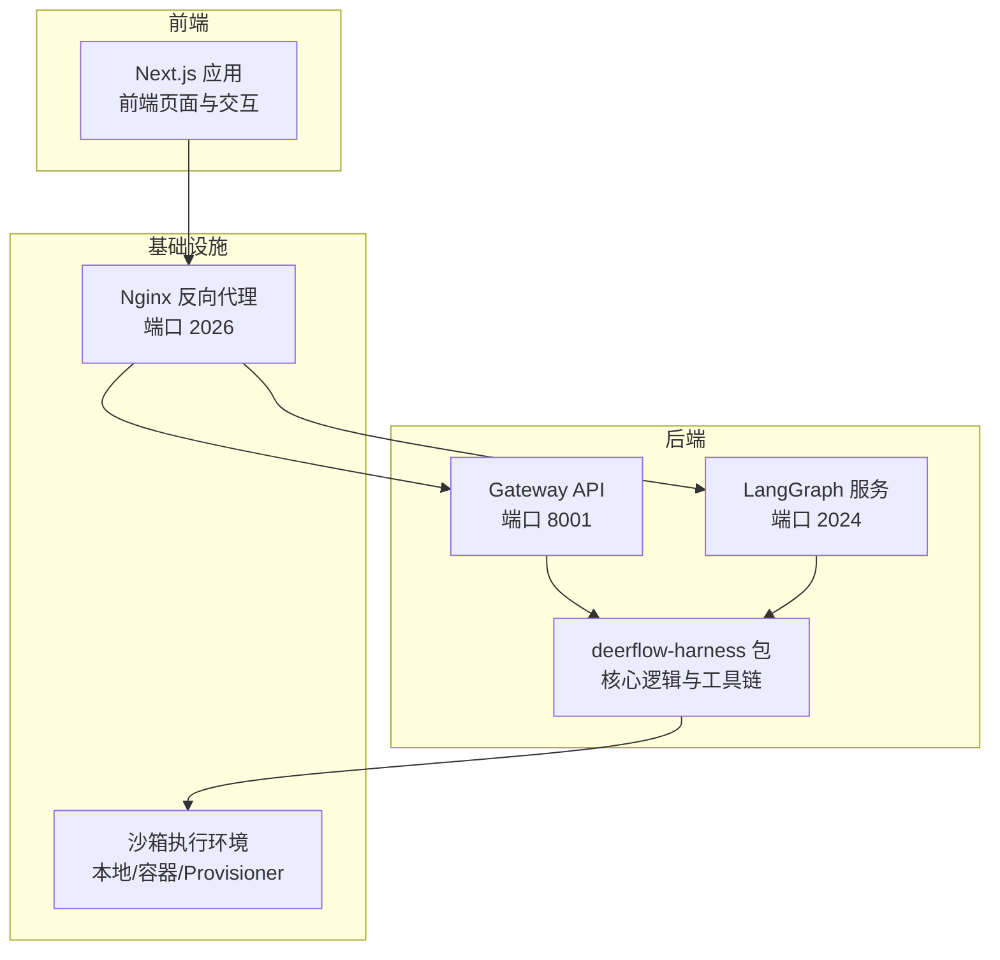
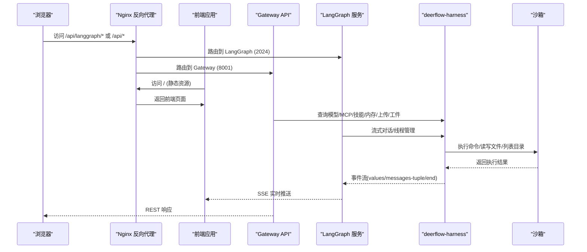
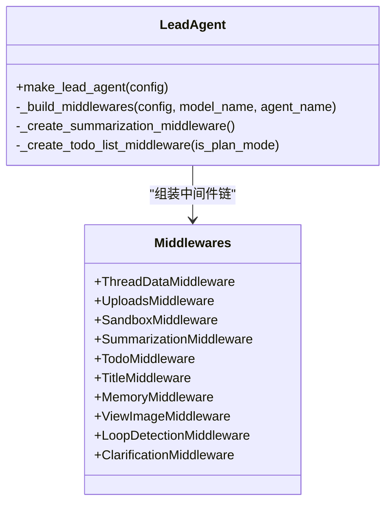
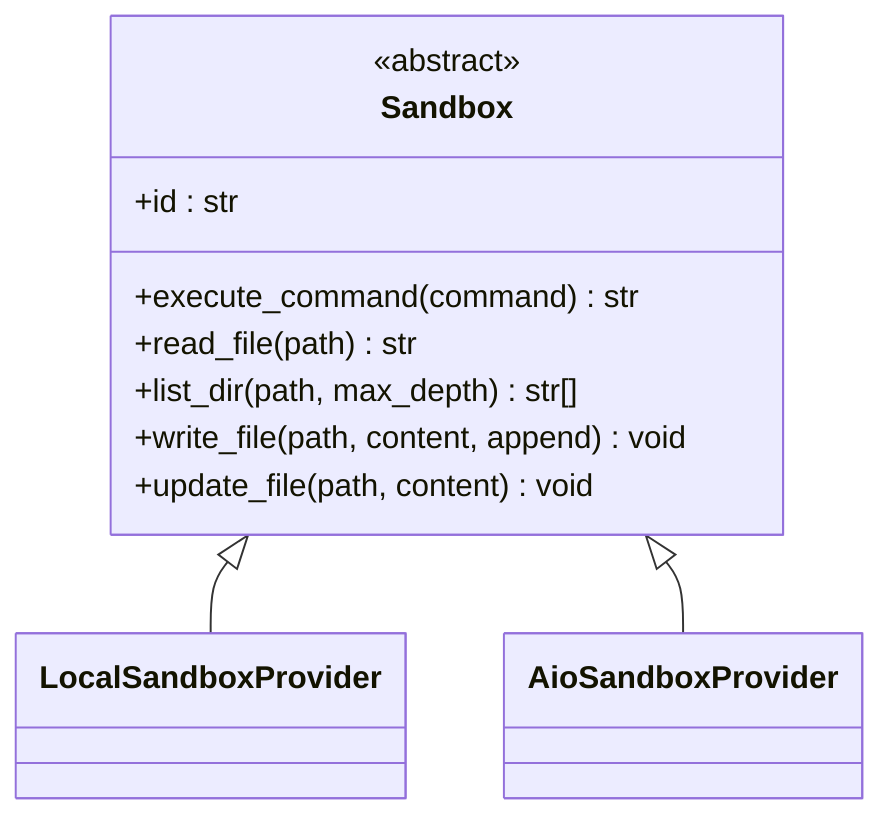
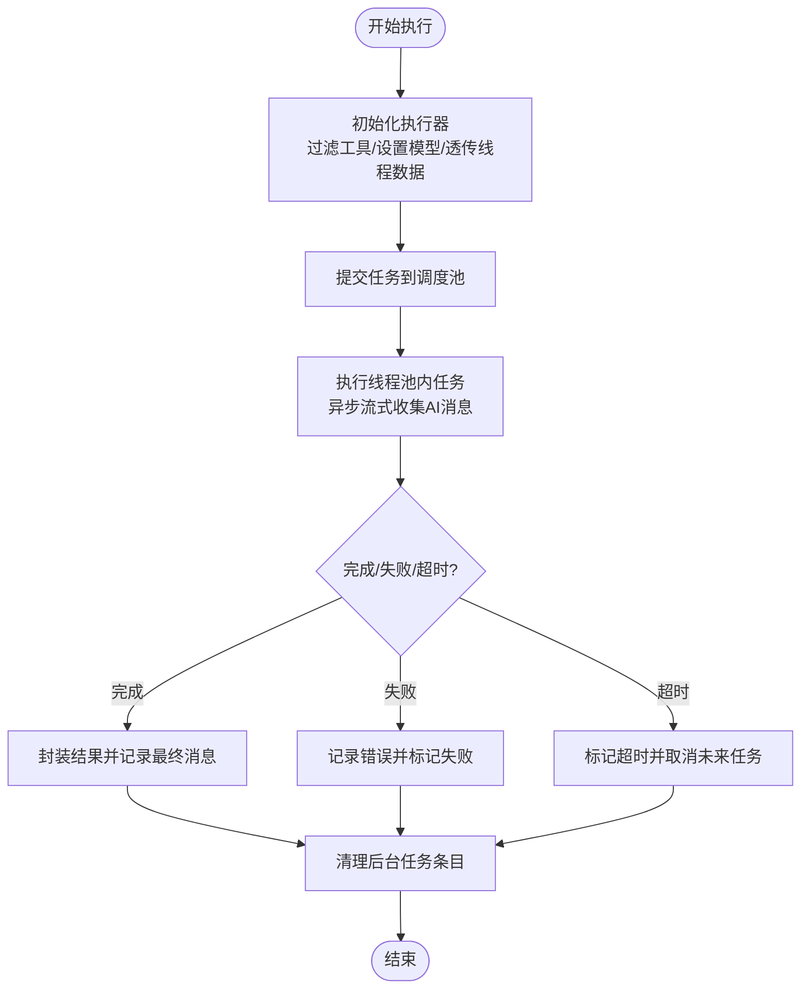
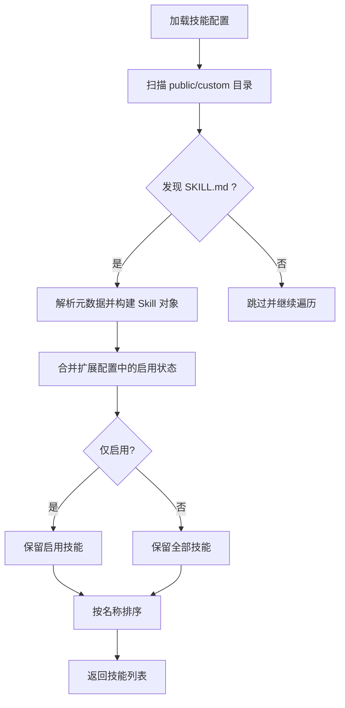
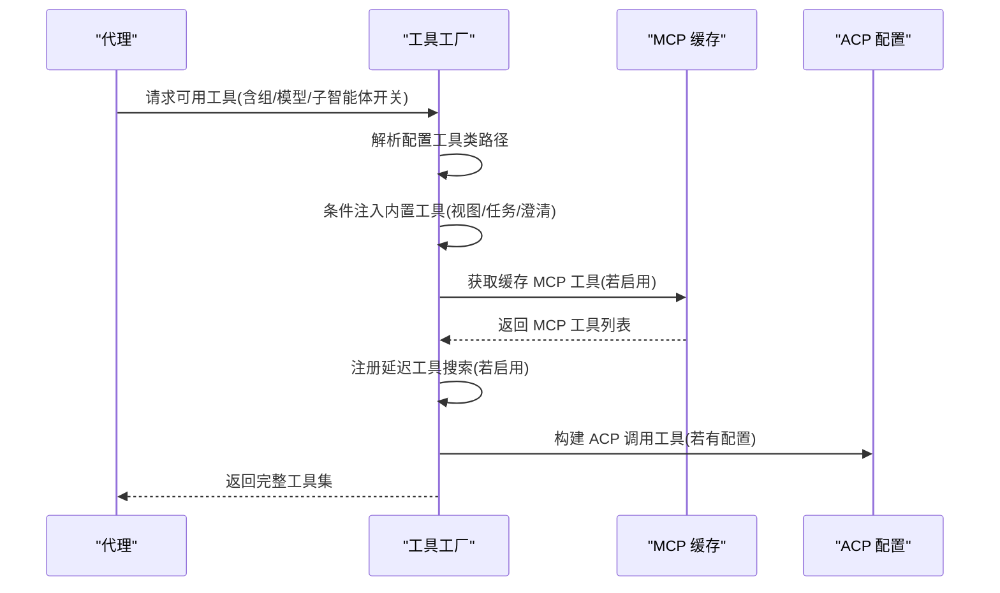
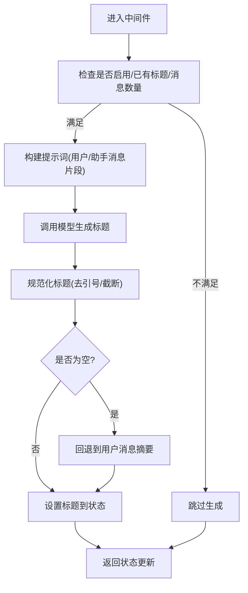
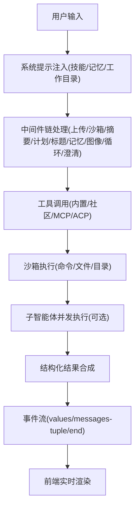
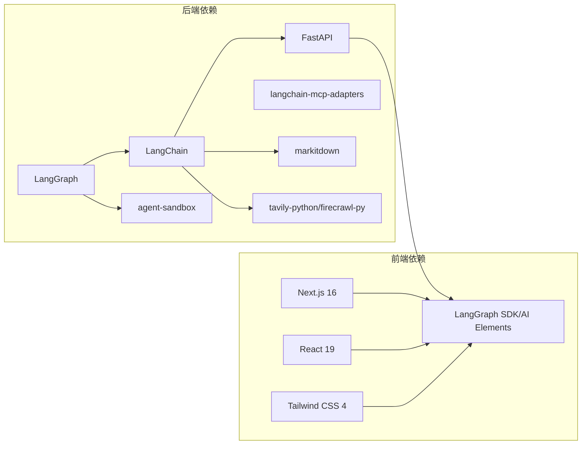

# 项目概述

<cite>
**本文档引用的文件**
- [README.md](file://README.md)
- [backend/README.md](file://backend/README.md)
- [frontend/README.md](file://frontend/README.md)
- [CONTRIBUTING.md](file://CONTRIBUTING.md)
- [backend/pyproject.toml](file://backend/pyproject.toml)
- [frontend/package.json](file://frontend/package.json)
- [backend/Makefile](file://backend/Makefile)
- [backend/packages/harness/deerflow/client.py](file://backend/packages/harness/deerflow/client.py)
- [backend/packages/harness/deerflow/agents/lead_agent/agent.py](file://backend/packages/harness/deerflow/agents/lead_agent/agent.py)
- [backend/packages/harness/deerflow/sandbox/sandbox.py](file://backend/packages/harness/deerflow/sandbox/sandbox.py)
- [backend/packages/harness/deerflow/subagents/executor.py](file://backend/packages/harness/deerflow/subagents/executor.py)
- [backend/packages/harness/deerflow/tools/tools.py](file://backend/packages/harness/deerflow/tools/tools.py)
- [backend/packages/harness/deerflow/skills/loader.py](file://backend/packages/harness/deerflow/skills/loader.py)
- [backend/packages/harness/deerflow/agents/middlewares/title_middleware.py](file://backend/packages/harness/deerflow/agents/middlewares/title_middleware.py)
</cite>

## 目录
1. [引言](#引言)
2. [项目结构](#项目结构)
3. [核心组件](#核心组件)
4. [架构总览](#架构总览)
5. [详细组件分析](#详细组件分析)
6. [依赖关系分析](#依赖关系分析)
7. [性能考量](#性能考量)
8. [故障排查指南](#故障排查指南)
9. [结论](#结论)
10. [附录](#附录)

## 引言
DeerFlow 是一个基于 LangGraph 和 LangChain 构建的“超级智能体编排平台”，旨在将研究、工具、子智能体与持久化记忆整合为可扩展的执行环境。它从早期的 Deep Research 框架演进而来，现已发展为“超级智能体 harness（马戏团）”——即开即用、可插拔、具备沙箱执行能力与多模态工具链的完整工作流引擎。

- 核心价值：通过“技能（Skills）+ 工具（Tools）+ 子智能体（Subagents）+ 沙箱（Sandbox）+ 记忆（Memory）”的组合，实现从研究到自动化生产的全链路智能体编排。
- 历史演进：从 Deep Research 到 2.0 版本的完全重写，不再需要手工拼装框架，而是提供“电池已内置”的运行时。
- 设计理念：模块化中间件链、按需加载技能、隔离沙箱执行、长程记忆与标题自动生成、计划模式与并行子任务调度。

## 项目结构
项目采用前后端分离与多包工作区的组织方式，后端以 Python 包“deerflow-harness”为核心，前端以 Next.js 为基础，配合 Docker Compose 与 Nginx 提供统一入口与代理路由。

图表来源
- [backend/README.md:7-41](file://backend/README.md#L7-L41)
- [CONTRIBUTING.md:107-118](file://CONTRIBUTING.md#L107-L118)

章节来源
- [backend/README.md:7-41](file://backend/README.md#L7-L41)
- [CONTRIBUTING.md:107-118](file://CONTRIBUTING.md#L107-L118)

## 核心组件
- 领导智能体（Lead Agent）
  - 负责接收用户消息、构建系统提示、装配工具与中间件，并协调子智能体并发执行。
  - 支持动态模型选择、思维/推理能力开关、计划模式与子智能体并发限制。
- 中间件链（Middlewares）
  - 顺序执行的横切关注点集合，包括线程数据隔离、上传注入、沙箱生命周期、摘要、待办清单、标题生成、记忆队列、图像注入、循环检测与澄清拦截等。
- 沙箱系统（Sandbox）
  - 抽象接口定义命令执行、文件读写、目录遍历与二进制更新；支持本地与容器两种提供者。
- 子智能体执行器（Subagent Executor）
  - 并发调度与超时控制，异步流式收集子任务结果，支持工具过滤与模型继承策略。
- 技能系统（Skills）
  - 递归扫描公共与自定义技能目录，解析 SKILL.md 元数据，按启用状态注入系统提示。
- 工具生态（Tools）
  - 内置工具（文件展示、澄清请求、图片查看、任务委派）、社区工具（搜索/抓取/图像）、MCP 扩展与 ACP 集成。
- 记忆系统（Memory）
  - 自动抽取用户上下文、事实与偏好，结构化存储并注入系统提示，支持去重与节流更新。
- 网关 API（Gateway）
  - 提供模型、MCP、技能、内存、上传、工件与线程管理等 REST 接口。

章节来源
- [backend/README.md:44-136](file://backend/README.md#L44-L136)
- [backend/packages/harness/deerflow/agents/lead_agent/agent.py:268-344](file://backend/packages/harness/deerflow/agents/lead_agent/agent.py#L268-L344)
- [backend/packages/harness/deerflow/sandbox/sandbox.py:4-73](file://backend/packages/harness/deerflow/sandbox/sandbox.py#L4-L73)
- [backend/packages/harness/deerflow/subagents/executor.py:123-517](file://backend/packages/harness/deerflow/subagents/executor.py#L123-L517)
- [backend/packages/harness/deerflow/skills/loader.py:22-99](file://backend/packages/harness/deerflow/skills/loader.py#L22-L99)
- [backend/packages/harness/deerflow/tools/tools.py:23-115](file://backend/packages/harness/deerflow/tools/tools.py#L23-L115)

## 架构总览
下图展示了从浏览器到后端服务、再到沙箱执行的整体调用路径与职责边界。

图表来源
- [backend/README.md:37-41](file://backend/README.md#L37-L41)
- [CONTRIBUTING.md:192-202](file://CONTRIBUTING.md#L192-L202)

章节来源
- [backend/README.md:37-41](file://backend/README.md#L37-L41)
- [CONTRIBUTING.md:192-202](file://CONTRIBUTING.md#L192-L202)

## 详细组件分析

### 组件一：领导智能体与中间件链
- 组件职责
  - 动态解析模型配置，按需启用思维/推理能力。
  - 组装中间件链，确保线程数据隔离、上传注入、沙箱生命周期、摘要、计划模式、标题生成、记忆队列、图像注入、循环检测与澄清拦截的正确顺序。
  - 注入系统提示，融合技能、记忆与工作目录指引。
- 关键流程
  - 请求进入后，先解析运行时参数（模型名、是否计划模式、是否启用子智能体等），再构建中间件链与工具集，最后创建代理实例。
  - 在流式响应中，按事件类型输出 values、messages-tuple 与 end，便于前端实时渲染与统计 token 使用量。

图表来源
- [backend/packages/harness/deerflow/agents/lead_agent/agent.py:208-265](file://backend/packages/harness/deerflow/agents/lead_agent/agent.py#L208-L265)

章节来源
- [backend/packages/harness/deerflow/agents/lead_agent/agent.py:268-344](file://backend/packages/harness/deerflow/agents/lead_agent/agent.py#L268-L344)
- [backend/packages/harness/deerflow/agents/middlewares/title_middleware.py:22-150](file://backend/packages/harness/deerflow/agents/middlewares/title_middleware.py#L22-L150)

### 组件二：沙箱抽象与执行
- 组件职责
  - 定义统一的沙箱接口：命令执行、文件读写、目录遍历、二进制更新。
  - 提供本地与容器两种提供者，支持虚拟路径映射与技能目录挂载。
- 关键流程
  - 每个会话拥有独立的工作空间、上传与输出目录，避免跨会话污染。
  - 文件转换（PDF/PPT/Excel/Word）在上传阶段自动转为 Markdown，便于后续处理。

图表来源
- [backend/packages/harness/deerflow/sandbox/sandbox.py:4-73](file://backend/packages/harness/deerflow/sandbox/sandbox.py#L4-L73)

章节来源
- [backend/packages/harness/deerflow/sandbox/sandbox.py:4-73](file://backend/packages/harness/deerflow/sandbox/sandbox.py#L4-L73)

### 组件三：子智能体执行器与并发控制
- 组件职责
  - 并发调度与超时控制（最大并发数与单任务超时），异步流式收集子任务结果。
  - 工具过滤（允许/禁止列表）、模型继承策略（继承父模型或指定子模型）、线程数据透传。
- 关键流程
  - 通过任务 ID 追踪后台任务状态，支持轮询查询与清理回收，防止内存泄漏。

图表来源
- [backend/packages/harness/deerflow/subagents/executor.py:391-453](file://backend/packages/harness/deerflow/subagents/executor.py#L391-L453)

章节来源
- [backend/packages/harness/deerflow/subagents/executor.py:123-517](file://backend/packages/harness/deerflow/subagents/executor.py#L123-L517)

### 组件四：技能加载与系统提示注入
- 组件职责
  - 递归扫描公共与自定义技能目录，解析 SKILL.md 元数据，按启用状态注入系统提示。
  - 支持按需加载，避免一次性加载全部技能导致上下文膨胀。
- 关键流程
  - 从配置读取技能根目录，遍历目录树，遇到 SKILL.md 即解析；随后合并扩展配置中的启用状态，排序返回。

图表来源
- [backend/packages/harness/deerflow/skills/loader.py:22-99](file://backend/packages/harness/deerflow/skills/loader.py#L22-L99)

章节来源
- [backend/packages/harness/deerflow/skills/loader.py:22-99](file://backend/packages/harness/deerflow/skills/loader.py#L22-L99)

### 组件五：工具生态与 MCP/ACP 集成
- 组件职责
  - 统一加载配置中的工具，条件性注入内置工具（如图片查看、任务委派）与 MCP 工具。
  - 支持延迟注册与工具搜索，减少模型绑定负担。
- 关键流程
  - 读取应用配置，解析工具类路径；根据模型能力决定是否注入视觉相关工具；加载 MCP 缓存工具并注册延迟工具搜索。

图表来源
- [backend/packages/harness/deerflow/tools/tools.py:23-115](file://backend/packages/harness/deerflow/tools/tools.py#L23-L115)

章节来源
- [backend/packages/harness/deerflow/tools/tools.py:23-115](file://backend/packages/harness/deerflow/tools/tools.py#L23-L115)

### 组件六：标题自动生成中间件
- 组件职责
  - 在首次完整对话交换后自动生成标题，支持同步与异步两种生成路径，并提供回退策略。
- 关键流程
  - 判断是否满足生成条件（已启用、无既有标题、至少一次人类与一次 AI 消息）；构建提示词模板；调用模型生成；规范化输出长度；异常时回退至用户首句摘要。

图表来源
- [backend/packages/harness/deerflow/agents/middlewares/title_middleware.py:46-150](file://backend/packages/harness/deerflow/agents/middlewares/title_middleware.py#L46-L150)

章节来源
- [backend/packages/harness/deerflow/agents/middlewares/title_middleware.py:22-150](file://backend/packages/harness/deerflow/agents/middlewares/title_middleware.py#L22-L150)

### 概念性总览
以下为概念性工作流，帮助初学者理解从输入到产出的整体过程：

（该图为概念性说明，无需图表来源）

## 依赖关系分析
- 后端技术栈
  - LangGraph 1.0.6+：多智能体编排与流式事件
  - LangChain 1.2.3+：LLM 抽象与工具系统
  - FastAPI 0.115.0+：网关 REST API
  - langchain-mcp-adapters：MCP 协议适配
  - agent-sandbox：沙箱执行
  - markitdown：多格式文档转换
  - tavily-python / firecrawl-py：网络搜索与抓取
- 前端技术栈
  - Next.js 16 + App Router：现代前端架构
  - React 19 + Tailwind CSS 4 + Shadcn UI：组件体系
  - LangGraph SDK 与 Vercel AI Elements：AI 交互集成

图表来源
- [backend/README.md:345-354](file://backend/README.md#L345-L354)
- [frontend/README.md:5-10](file://frontend/README.md#L5-L10)

章节来源
- [backend/README.md:345-354](file://backend/README.md#L345-L354)
- [frontend/README.md:5-10](file://frontend/README.md#L5-L10)

## 性能考量
- 上下文工程
  - 通过摘要中间件在接近令牌上限时主动压缩历史，降低长对话的上下文开销。
- 工具绑定优化
  - 延迟注册与工具搜索减少模型绑定负担，避免一次性暴露过多工具签名。
- 并发与超时
  - 子智能体最大并发数与单任务超时控制，防止资源争用与长时间阻塞。
- 文件转换与 I/O
  - 上传阶段对特定格式进行转换，减少后续处理复杂度；沙箱提供虚拟路径映射，避免跨会话污染。
- 模型选择
  - 支持轻量模型用于摘要等场景，节省成本；同时允许在配置中指定专用模型。

（本节为通用指导，无需章节来源）

## 故障排查指南
- Docker 开发环境权限问题（Linux）
  - 症状：Docker 相关命令报“权限被拒绝”
  - 处理：将当前用户加入 docker 组并重新登录，或使用新组会话生效
- 沙箱模式检测与 Provisioner K8s 配置
  - 症状：容器模式启动失败或无法识别
  - 处理：检查配置文件中的沙箱提供者与 K8s 凭据路径，确保权限与网络可达
- MCP 服务器连接失败
  - 症状：MCP 工具不可见或调用报错
  - 处理：确认 MCP 服务器地址、认证与传输协议；检查扩展配置文件中的启用状态与凭据
- 子智能体超时或失败
  - 症状：任务长时间无响应或直接失败
  - 处理：调整最大并发数与超时阈值；检查工具可用性与沙箱权限；查看日志定位具体错误

章节来源
- [CONTRIBUTING.md:73-106](file://CONTRIBUTING.md#L73-L106)
- [CONTRIBUTING.md:280-284](file://CONTRIBUTING.md#L280-L284)

## 结论
DeerFlow 将“研究”升维为“编排”，通过“技能 + 工具 + 子智能体 + 沙箱 + 记忆”的组合拳，实现了从探索到落地的一体化智能体工作流。其模块化的中间件链、按需加载的技能系统、隔离的沙箱执行与长程记忆，既适合初学者快速上手，也为高级用户提供深度定制与扩展空间。建议结合实际业务场景选择合适的模型与工具集，并利用计划模式与子智能体并发能力提升复杂任务的执行效率。

## 附录
- 快速开始
  - Docker 开发：make docker-init → make docker-start
  - 本地开发：make check → make install → make dev
  - 前端：pnpm dev（默认端口 3000），后端：uv run langgraph dev（2024）与 uvicorn（8001）
- 嵌入式 Python 客户端
  - DeerFlowClient 提供与 HTTP 网关一致的响应模式，支持流式事件与多轮对话（需检查点器）
- 文档与配置
  - 后端架构与 API 参考、配置指南、文件上传与路径示例、摘要与计划模式均有详细文档

章节来源
- [README.md:77-254](file://README.md#L77-L254)
- [backend/README.md:139-211](file://backend/README.md#L139-L211)
- [frontend/README.md:11-52](file://frontend/README.md#L11-L52)
- [backend/Makefile:1-18](file://backend/Makefile#L1-L18)
- [backend/packages/harness/deerflow/client.py:75-800](file://backend/packages/harness/deerflow/client.py#L75-L800)